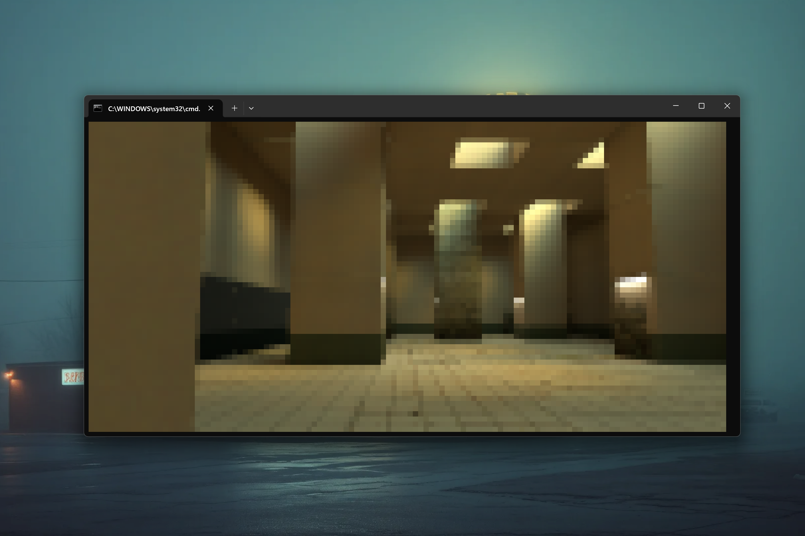

# FastTerminal3D 0.1.0 [ALPHA-2026-06] — High-Performance 3D Terminal Renderer for Java

**⚡ A cutting-edge 3D rasterization bridge for rendering complex 3D environments natively inside your True Color terminal.**

**FastTerminal3D** seamlessly bridges the 3D rendering pipeline of **[FastSoftware3D](https://github.com/andrestubbe/FastSoftware3D)** with the high-performance native ANSI rendering of **[FastTerminal](https://github.com/andrestubbe/FastTerminal)**. 

By applying advanced spatial SSAA downsampling, FastTerminal3D scales 3D graphics into Unicode half-block elements (`▀`) maintaining vivid 24-bit True Color while achieving maximum FPS via native C++ rasterization integration.

To run the terminal engine at maximum desktop-class framerates, it relies on the unified **FastJava** ecosystem:

* ⚡ **[FastSoftware3D](https://github.com/andrestubbe/FastSoftware3D)** — Provides the foundational math, clipping, shading, and multi-threaded triangle rasterization engine.
* 🚀 **[FastTerminal](https://github.com/andrestubbe/FastTerminal)** — Implements the native zero-copy ANSI viewport output and terminal scaling.

---

---

## 📚 Documentation & Guides

Learn more about the inner workings of FastTerminal3D and its architectural design:

* [**Philosophy & Architecture**](docs/PHILOSOPHY.md) - Why we built it and the design principles.
* [**Compilation & Build Guide**](docs/COMPILE.md) - Instructions for building the native bindings.
* [**API Reference**](docs/REFERENCE.md) - Technical API usage guide.
* [**Roadmap**](docs/ROADMAP.md) - Upcoming features and milestones.
* [**Changelog**](docs/CHANGELOG.md) - Version history.

---

## 🚀 Running the Demos

You can try the pre-configured Windows batch files right away:

- `run-demo.bat` — Simple rotating cube showcasing SSAA downsampling.
- `run-wolf-terminal-demo.bat` — The Wolfenstein 3D interactive terminal map viewer.

> **Note:** The terminal must support 24-bit True Color and UTF-8 encoding (e.g., Windows Terminal, Alacritty, or modern iTerm2).

---

## Installation

### Option 1: Maven (JitPack)

Add the JitPack repository and the library dependencies to your pom.xml:

`xml
<repositories>
    <repository>
        <id>jitpack.io</id>
        <url>https://jitpack.io</url>
    </repository>
</repositories>

<dependencies>
    <dependency>
        <groupId>com.github.andrestubbe</groupId>
        <artifactId>FastTerminal3D</artifactId>
        <version>0.1.0</version>
    </dependency>
    <dependency>
        <groupId>com.github.andrestubbe</groupId>
        <artifactId>FastSoftware3D</artifactId>
        <version>main-SNAPSHOT</version>
    </dependency>
    <dependency>
        <groupId>com.github.andrestubbe</groupId>
        <artifactId>FastTerminal</artifactId>
        <version>0.1.3</version>
    </dependency>
    <dependency>
        <groupId>com.github.andrestubbe</groupId>
        <artifactId>FastCore</artifactId>
        <version>0.1.0</version>
    </dependency>
</dependencies>
`

### Option 2: Gradle

Add JitPack to your repositories and include the library dependencies:

`groovy
repositories {
    maven { url 'https://jitpack.io' }
}

dependencies {
    implementation 'com.github.andrestubbe:FastTerminal3D:0.1.0'
    implementation 'com.github.andrestubbe:FastSoftware3D:main-SNAPSHOT'
    implementation 'com.github.andrestubbe:FastTerminal:0.1.3'
    implementation 'com.github.andrestubbe:FastCore:0.1.0'
}
`

