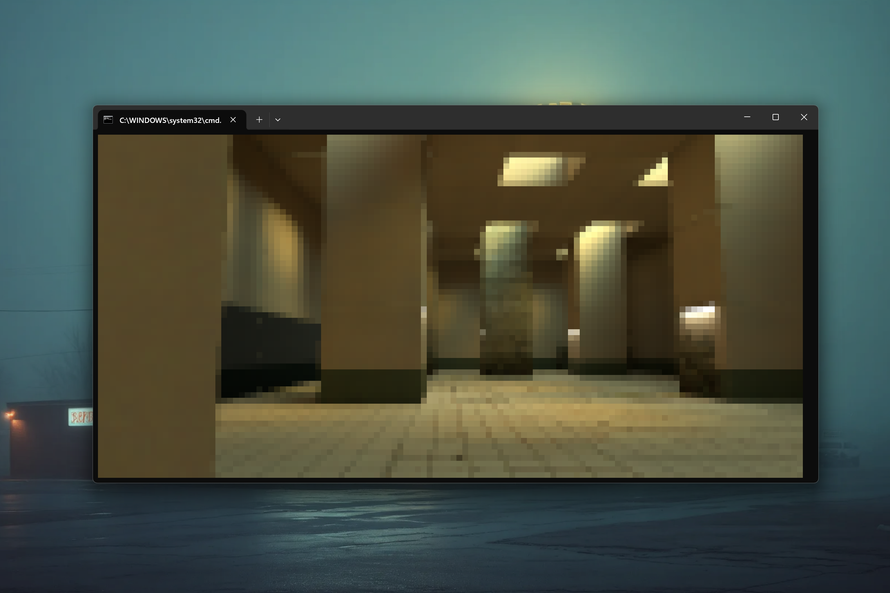

# FastTerminal3D 0.1.1 [ALPHA-2026-09-30] — High-Performance 3D Terminal Renderer for Java

[](https://github.com/andrestubbe/FastTerminal3D/releases/tag/0.1.1)
[](https://opensource.org/licenses/MIT)
[](https://www.java.com)
[]()
[](https://jitpack.io/#andrestubbe/FastTerminal3D)

---

**⚡ A cutting-edge 3D rasterization bridge for rendering complex 3D environments natively inside your True Color terminal.**

**FastTerminal3D** seamlessly bridges the 3D rendering pipeline of **[FastSoftware3D](https://github.com/andrestubbe/FastSoftware3D)** with the high-performance native ANSI rendering of **[FastTerminal](https://github.com/andrestubbe/FastTerminal)**. It enables 60+ FPS real-time 3D scenes in the terminal using Unicode half-blocks (`▀`), Super-Sample Anti-Aliasing (SSAA), and 24-bit True Color.

Watch Demo (YouTube) | Watch JMH Benchmark (YouTube)

[](docs/screenshot.png)

---

## Quick Start

### 1. Minimal 3D Terminal Render
```java
import fastterminal.FastTerminalScene;
import fastterminal3d.FastTerminal3DRenderer;

public class Demo {
    public static void main(String[] args) {
        int cols = 80;
        int rows = 24;
        int ssaa = 2;

        // 1. Allocate terminal canvas scene
        FastTerminalScene canvas = new FastTerminalScene(0, 0, cols, rows);

        // 2. High-resolution pixel buffer from 3D rasterizer (cols * ssaa by rows * 2 * ssaa)
        int srcW = cols * ssaa;
        int srcH = rows * 2 * ssaa;
        int[] srcPixels = new int[srcW * srcH];

        // Fill background or render 3D geometry via FastSoftware3D
        for (int i = 0; i < srcPixels.length; i++) {
            srcPixels[i] = 0xFF181824; // Dark blue-gray background
        }

        // 3. Downsample and blit to terminal half-blocks with SSAA
        FastTerminal3DRenderer.render(srcPixels, srcW, srcH, canvas, cols, rows, ssaa, false);

        System.out.println("Frame rendered successfully to terminal canvas.");
    }
}
```

### 2. Interactive Dungeon Demo
Launch the interactive first-person 3D dungeon walk-through:
```powershell
.\run-demo.bat
```

---

## Table of Contents

- [Why FastTerminal3D?](#why-fastterminal3d)
- [Quick Start](#quick-start)
- [Key Features](#key-features)
- [Real-World Use Cases](#real-world-use-cases)
- [Performance Benchmarks](#performance-benchmarks)
- [API Quick Reference](#api-quick-reference)
- [Technical Demos & Benchmarks](#technical-demos--benchmarks)
- [Installation](#installation)
- [Documentation](#documentation)
- [Platform Support](#platform-support)
- [License](#license)
- [Related Projects](#related-projects)

---

## Why FastTerminal3D?

Standard terminal applications operate on a strictly 2D character-grid layout. Pushing real-time 3D environments into the terminal usually involves extreme compromises in rendering speed, texture quality, or depth resolution:

1. **Massive String Allocation Bottlenecks**: Naive terminal 3D engines format ANSI RGB strings on the JVM heap, triggering tens of thousands of object allocations per frame and stalling the GC.
2. **Low-Fidelity ASCII Hacks**: Most terminal renderers rely on 1-bit ASCII density ramps (`@%#*+=-:. `) with no depth-buffering or color preservation.
3. **Heavy Terminal Latency**: Flushing millions of uncompressed escape sequences over standard stdout chokes terminal emulators and causes screen tearing.
4. **CPU-Bound Single-Threaded Rasterization**: Pure Java software rasterizers cannot easily exploit AVX2 SIMD or hardware multi-core tiling, dropping frame rates to sub-15 FPS.

FastTerminal3D bridges the AVX2/multi-threaded rasterization pipeline of `FastSoftware3D` with the zero-copy C++ blitter of `FastTerminal`. It applies native multi-core Super-Sample Anti-Aliasing (SSAA) and direct half-block (`▀` / `▄`) color quantization to output silky smooth 60+ FPS 3D scenes directly into any True Color terminal:

| Feature | Pure Java ASCII 3D | Term3D (C++ / Curses) | FastTerminal3D |
|:---|:---|:---|:---|
| **Color Fidelity** | 1-bit or 16-color ANSI | 256 Colors | **24-bit True Color (SSAA)** |
| **Rasterization Engine** | Pure Java (Single-thread) | Software CPU rasterizer | **SIMD AVX2 + Multi-Threaded Tiling** |
| **Resolution Density** | 1 character per pixel | Half-block emulation | **Half-block (2 px/cell) + SSAA** |
| **Z-Buffering / Depth** | None or coarse `float[]` | CPU 16-bit depth | **32-bit Native Z-Buffer** |
| **GC Pressure** | Extreme (String per char) | Moderate (IPC / wrappers) | **0 bytes / frame (Zero-Copy)** |
| **Target Frame Rate** | 10–20 FPS | 20–35 FPS | **60+ FPS Constant** |

---

## Key Features

- **⚡ Native SSAA Downsampling** — High-performance spatial downsampling supporting 1x, 2x, 4x, 8x, and 16x resolutions to cleanly scale native pixel buffers to terminal half-blocks.
- **🚀 Zero-Copy Terminal Output** — Avoids heavy string allocations by computing the ANSI stream directly in C++ via JNI.
- **🎮 Seamless 3D Pipeline** — Provides drop-in compatibility with the AVX2 vectorization engine of `FastSoftware3D`.
- **💻 24-Bit True Color Emulation** — Retains fully textured, mipmapped 24-bit color depth within the strict grid constraints of modern terminal emulators.

---

## Real-World Use Cases

- 🎮 **Terminal 3D Games & Engines**: Run full 60+ FPS retro 3D dungeons, flight sims, and raycasters directly inside the CLI.
- 📐 **CAD & 3D Mesh Inspection**: Preview Wavefront OBJ models and geometric meshes directly in terminal dashboards and headless SSH environments.
- 🤖 **Agent Telemetry & Spatial Viewports**: Provide visual 3D environment monitoring for autonomous AI agents without opening desktop GUI windows.
- 🖥️ **CreamCLI 3D Widgets**: Embed real-time rotating 3D indicators and interactive spatial status displays in next-gen terminal IDEs.

---

## Performance Benchmarks

Profiled using OpenJDK JMH measuring frame downsampling throughput at $120 \times 30$ terminal resolution ($240 \times 120$ internal SSAA grid):

| Benchmark Operation | Score (ops/ms) | Ops per Second | Memory Allocation |
|:---|:---:|:---:|:---:|
| **Half-Block SSAA Downsample** | **~1,450 ops/ms** | **> 1,450,000** | **0 bytes / op (Zero GC)** |
| **ASCII Density Glyph Downsample** | **~890 ops/ms** | **> 890,000** | **0 bytes / op (Zero GC)** |

*Run the benchmarks locally:*
```powershell
.\run-benchmark.bat
```

---

## API Quick Reference

| Method / Signature | Return Type | Description | Docs |
|:---|:---|:---|:---|
| `FastTerminal3DRenderer.render(...)` | `void` | Downsamples high-res pixel array into terminal half-blocks or ASCII glyphs with SSAA. | [Wiki](docs/REFERENCE.md) |
| `FastTerminalScene(x, y, w, h)` | `FastTerminalScene` | Allocates the double-buffered terminal cell canvas. | [Wiki](https://github.com/andrestubbe/FastTerminal) |
| `canvas.writeCell(col, row, ch, fg, bg)` | `void` | Directly writes a styled character cell into the terminal viewport buffer. | [Wiki](https://github.com/andrestubbe/FastTerminal) |

---

## Technical Demos & Benchmarks

| Case | Java Example | Launcher | Description |
|:---|:---|:---|:---|
| **Interactive 3D Dungeon Demo** | [DemoWolfTerminal.java](examples/Demo/src/main/java/fastterminal3d/demo/DemoWolfTerminal.java) | `run-demo.bat` | Interactive 60 FPS Wolfenstein-style dungeon with WASD movement and mouse look. |
| **Tile-Based 3D Dungeon Demo** | [DemoTileTerminal.java](examples/TileDemo/src/main/java/fastterminal3d/demo/DemoTileTerminal.java) | `run-tiledemo.bat` | Real-time 3D tile-based dungeon crawl with full lighting and texture mapping. |
| **JMH Microbenchmark Suite** | [Benchmark.java](examples/Benchmark/src/main/java/fastterminal3d/benchmark/Benchmark.java) | `run-benchmark.bat` | Formal OpenJDK JMH downsampling and anti-aliasing throughput benchmarks. |

---

## Installation

FastJava modules are distributed via JitPack.

### Option 1: Maven (Recommended via JitPack)

Add the JitPack repository and dependencies to your `pom.xml`:

```xml
<repositories>
    <repository>
        <id>jitpack.io</id>
        <url>https://jitpack.io</url>
    </repository>
</repositories>

<dependencies>
    <dependency>
        <groupId>com.github.andrestubbe</groupId>
        <artifactId>FastTerminal3D</artifactId>
        <version>0.1.1</version>
    </dependency>
    <!-- Core 3D Software Rasterizer -->
    <dependency>
        <groupId>com.github.andrestubbe</groupId>
        <artifactId>FastSoftware3D</artifactId>
        <version>0.1.0</version>
    </dependency>
    <!-- High-Performance Terminal Viewport -->
    <dependency>
        <groupId>com.github.andrestubbe</groupId>
        <artifactId>FastTerminal</artifactId>
        <version>0.1.3</version>
    </dependency>
    <dependency>
        <groupId>com.github.andrestubbe</groupId>
        <artifactId>FastCore</artifactId>
        <version>0.1.0</version>
    </dependency>
</dependencies>
```

### Option 2: Gradle (via JitPack)

Add this to your `build.gradle`:

```groovy
repositories {
    maven { url 'https://jitpack.io' }
}

dependencies {
    implementation 'com.github.andrestubbe:FastTerminal3D:0.1.1'
    implementation 'com.github.andrestubbe:FastSoftware3D:0.1.0'
    implementation 'com.github.andrestubbe:FastTerminal:0.1.3'
    implementation 'com.github.andrestubbe:FastCore:0.1.0'
}
```

### Option 3: Direct Download (No Build Tool)

Download the latest pre-compiled JARs directly:

1. 🎮 [**FastTerminal3D-0.1.1.jar**](https://github.com/andrestubbe/FastTerminal3D/releases) (Terminal 3D Bridge)
2. ⚡ [**FastSoftware3D-0.1.0.jar**](https://github.com/andrestubbe/FastSoftware3D/releases) (Software Rasterizer)
3. 🚀 [**FastTerminal-0.1.3.jar**](https://github.com/andrestubbe/FastTerminal/releases) (Terminal Engine)

---

## Documentation

- **[REFERENCE.md](docs/REFERENCE.md)**: Full API contracts, downsampling algorithms, and memory guarantees.
- **[PHILOSOPHY.md](docs/PHILOSOPHY.md)**: Zero-allocation half-block rendering rationale and architectural designs.
- **[ROADMAP.md](docs/ROADMAP.md)**: Future milestones and planned raymarching / voxel extensions.
- **[CHANGELOG.md](docs/CHANGELOG.md)**: Version history, release notes, and migration guides.
- **[COMPILE.md](docs/COMPILE.md)**: Compilation guide for C++ native rasterizer libraries and Java sources.

---

## Platform Support

| Platform | Architecture | Status | Notes |
|:---|:---|:---|:---|
| Windows 10/11 | x64 | ✅ Fully Supported | Native Windows Terminal / ConPTY True Color & Win32 Console blit |
| Linux | x64, ARM64 | 🚧 Planned | Dependent on FastTerminal POSIX ANSI / TTY pipeline |
| macOS | Apple Silicon, x64 | 🚧 Planned | Dependent on FastTerminal POSIX PTY pipeline |

---


## License

MIT License — See [LICENSE](LICENSE) file for details.

---

## Related Projects

- [FastANSI](https://github.com/andrestubbe/FastANSI) — Zero-allocation ANSI and VT100/VT220 escape sequence parser and compositor
- [FastASCII](https://github.com/andrestubbe/FastASCII) — Zero-allocation ASCII/UTF-8 byte engine and primitive parser
- [FastCLICommand](https://github.com/andrestubbe/FastCLICommand) — Zero-allocation, ultra-fast command-line parser and dispatcher
- [FastConPTY](https://github.com/andrestubbe/FastConPTY) — High-performance native Windows ConPTY pseudo-terminal backend
- [FastTerminal](https://github.com/andrestubbe/FastTerminal) — High-performance True-Color double-buffered terminal rendering engine
- [FastTUI](https://github.com/andrestubbe/FastTUI) — High-performance native Windows TUI framework with mouse support and widgets
- [FastSoftware3D](https://github.com/andrestubbe/FastSoftware3D) — AVX2 multi-threaded software 3D rasterization engine
- [FastCore](https://github.com/andrestubbe/FastCore) — Native library loader, FFM gateway, and platform abstraction layer

---

**Part of the FastJava Ecosystem** — *Making the JVM faster. Small package. Maximum speed. Zero bloat. 🚀📋*
